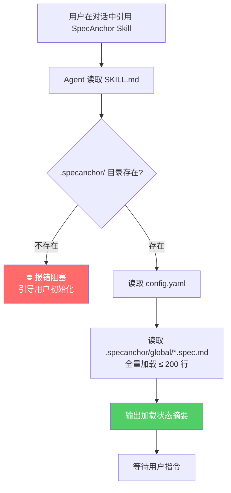
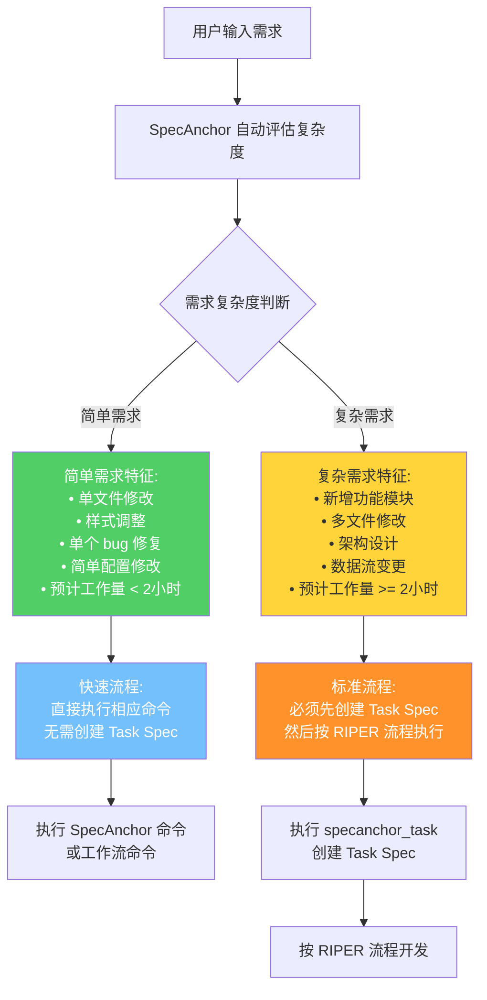
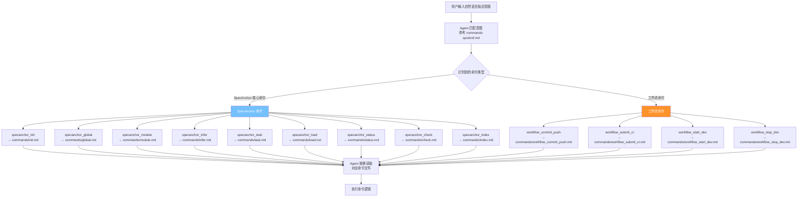
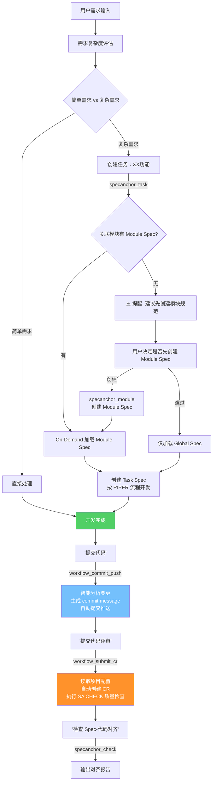
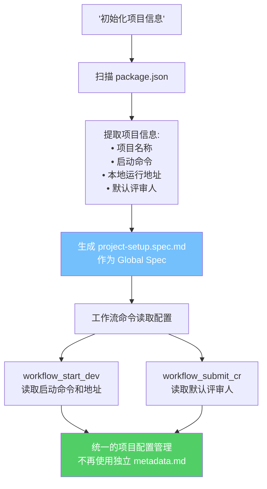
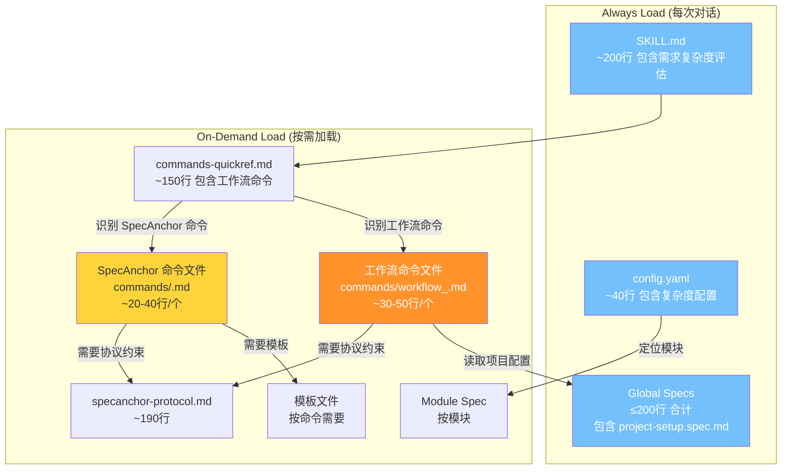
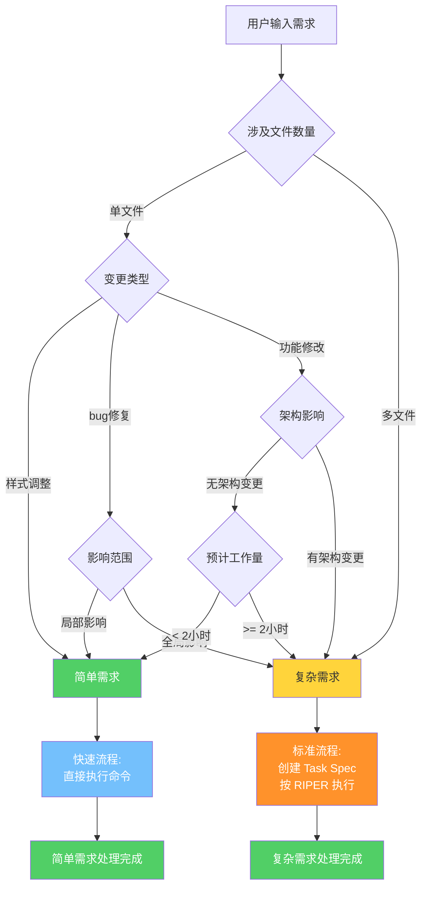

# SpecAnchor Skill 调用全链路流程图

## 1. Skill 启动与加载链路

## 2. 需求复杂度评估与流程选择

## 3. 用户意图识别与命令分发

## 4. 核心场景链路：首次使用

## 5. 核心场景链路：完整开发工作流

## 6. 工作流命令详细流程

```mermaid
flowchart TD
    subgraph "开发服务器管理"
        A1["'启动项目'"] -->|workflow_start_dev| A2[从 project-setup.spec.md<br/>读取启动命令]
        A2 --> A3[执行启动命令<br/>检测服务器状态]
        A3 --> A4[自动打开浏览器<br/>访问本地地址]

        B1["'停止项目'"] -->|workflow_stop_dev| B2[检测运行中的服务器]
        B2 --> B3[停止开发服务器<br/>清理进程]
    end

    subgraph "代码管理"
        C1["'提交代码'"] -->|workflow_commit_push| C2[检查代码状态<br/>分析变更类型]
        C2 --> C3[生成符合规范的<br/>commit message]
        C3 --> C4[执行 git add & commit<br/>推送到远程仓库]
    end

    subgraph "代码评审"
        D1["'提交代码评审'"] -->|workflow_submit_cr| D2[从 project-setup.spec.md<br/>读取评审人配置]
        D2 --> D3[执行 codereview.sh<br/>创建代码评审]
        D3 --> D4[运行 SA CHECK<br/>质量检查]
        D4 --> D5[提取 CR 链接<br/>询问是否打开]
    end

    style A4 fill:#51cf66,color:#fff
    style B3 fill:#51cf66,color:#fff
    style C4 fill:#51cf66,color:#fff
    style D5 fill:#51cf66,color:#fff
```

## 7. 项目配置管理流程

## 8. 文件读取层级（Agent 上下文管理）

## 9. 全景架构图

```mermaid
graph TB
    subgraph "用户层"
        U[用户自然语言 / SA 命令<br/>包含开发需求和工作流命令]
    end

    subgraph "Skill 入口层"
        S[SKILL.md<br/>包含需求复杂度评估]
        Q[commands-quickref.md<br/>意图映射 + 工作流命令]
    end

    subgraph "SpecAnchor 命令层"
        C1[init.md]
        C2[global.md<br/>包含项目配置管理]
        C3[module.md]
        C4[infer.md]
        C5[task.md]
        C6[load.md]
        C7[status.md]
        C8[check.md]
        C9[index.md]
    end

    subgraph "工作流命令层"
        W1[workflow_commit_push.md<br/>代码提交推送]
        W2[workflow_submit_cr.md<br/>代码评审]
        W3[workflow_start_dev.md<br/>启动开发服务器]
        W4[workflow_stop_dev.md<br/>停止开发服务器]
    end

    subgraph "协议层"
        P1[specanchor-protocol.md<br/>核心协议]
        P2[SDD-RIPER-ONE<br/>写作协议 可替换]
    end

    subgraph "模板层"
        T1[global-spec-template.md<br/>包含 project-setup 类型]
        T2[module-spec-template.md]
        T3[task-spec-template.md]
    end

    subgraph "产出层 (.specanchor/)"
        O1[config.yaml<br/>包含复杂度评估配置]
        O2[global/*.spec.md<br/>包含 project-setup.spec.md]
        O3[modules/*.spec.md]
        O4[tasks/**/*.spec.md]
        O5[module-index.md]
    end

    subgraph "检测层"
        D1[specanchor-check.sh]
    end

    U --> S
    S --> Q
    Q --> C1 & C2 & C3 & C4 & C5 & C6 & C7 & C8 & C9
    Q --> W1 & W2 & W3 & W4
    C1 & C2 & C3 & C4 & C5 & C6 & C7 & C8 & C9 --> P1
    W1 & W2 & W3 & W4 --> P1
    C5 --> P2
    C2 --> T1
    C3 & C4 --> T2
    C5 --> T3
    C1 --> O1
    C2 --> O2
    C3 & C4 --> O3
    C5 --> O4
    C3 & C4 & C7 & C9 --> O5
    C8 --> D1
    W1 & W2 & W3 & W4 --> O2

    style U fill:#845ef7,color:#fff
    style S fill:#74c0fc,color:#fff
    style Q fill:#74c0fc,color:#fff
    style C2 fill:#51cf66,color:#fff
    style W1 fill:#ff922b,color:#fff
    style W2 fill:#ff922b,color:#fff
    style W3 fill:#ff922b,color:#fff
    style W4 fill:#ff922b,color:#fff
    style P1 fill:#ff922b,color:#fff
    style P2 fill:#ff922b,color:#fff
    style O2 fill:#51cf66,color:#fff
```

## 10. 需求复杂度评估决策树

