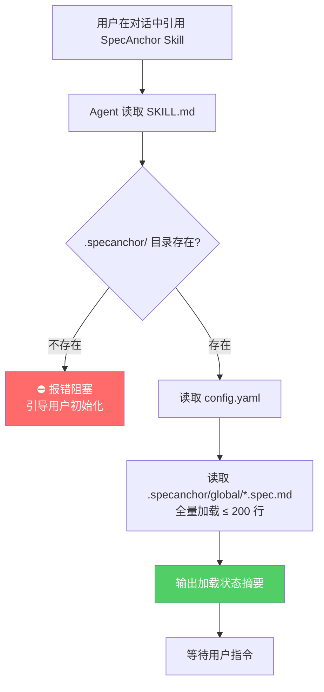
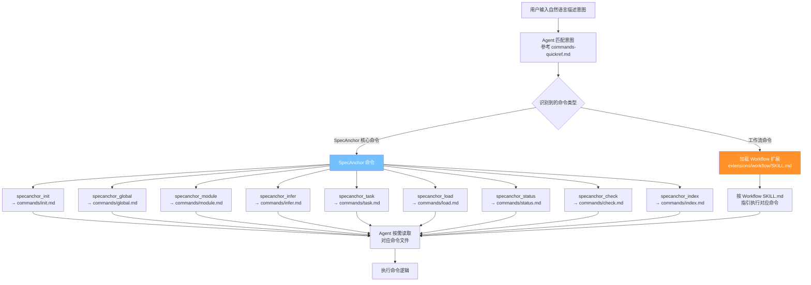
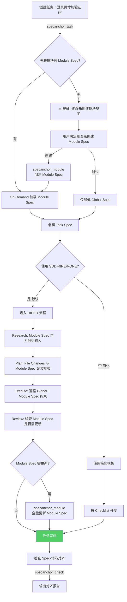
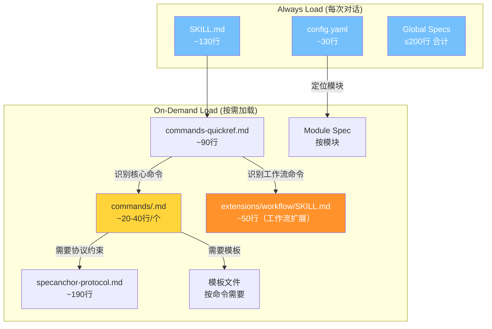
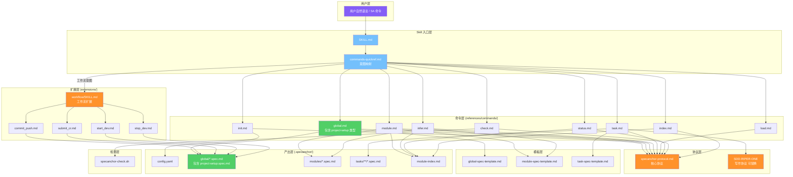

# SpecAnchor Skill 调用全链路流程图

## 1. Skill 启动与加载链路

```mermaid
flowchart TD
    A[用户在对话中引用 SpecAnchor Skill] --> B[Agent 读取 SKILL.md]
    B --> C{.specanchor/ 目录存在?}
    C -->|不存在| D["⛔ 报错阻塞<br/>引导用户初始化"]
    C -->|存在| E[读取 config.yaml]
    E --> F[读取 .specanchor/global/*.spec.md<br/>全量加载 ≤ 200 行]
    F --> G[输出加载状态摘要]
    G --> H[等待用户指令]

    style D fill:#ff6b6b,color:#fff
    style G fill:#51cf66,color:#fff
```

## 2. 用户意图识别与命令分发

```mermaid
flowchart TD
    H[用户输入自然语言描述意图] --> I[Agent 匹配意图<br/>参考 commands-quickref.md]
    I --> J{识别到的命令类型}

    J -->|SpecAnchor 核心命令| K[SpecAnchor 命令]
    J -->|工作流命令| L[加载 Workflow 扩展<br/>extensions/workflow/SKILL.md]

    K --> K1["specanchor_init<br/>→ commands/init.md"]
    K --> K2["specanchor_global<br/>→ commands/global.md"]
    K --> K3["specanchor_module<br/>→ commands/module.md"]
    K --> K4["specanchor_infer<br/>→ commands/infer.md"]
    K --> K5["specanchor_task<br/>→ commands/task.md"]
    K --> K6["specanchor_load<br/>→ commands/load.md"]
    K --> K7["specanchor_status<br/>→ commands/status.md"]
    K --> K8["specanchor_check<br/>→ commands/check.md"]
    K --> K9["specanchor_index<br/>→ commands/index.md"]

    L --> L1[按 Workflow SKILL.md<br/>指引执行对应命令]

    K1 --> T[Agent 按需读取<br/>对应命令文件]
    K2 --> T
    K3 --> T
    K4 --> T
    K5 --> T
    K6 --> T
    K7 --> T
    K8 --> T
    K9 --> T
    L1 --> T

    T --> U[执行命令逻辑]

    style K fill:#74c0fc,color:#fff
    style L fill:#ff922b,color:#fff
```

## 3. 核心场景链路：首次使用

```mermaid
flowchart LR
    A["'初始化 SpecAnchor'"] -->|specanchor_init| B[创建 .specanchor/ 目录]
    B --> C["'初始化项目信息'"]
    C -->|specanchor_global<br/>project-setup 类型| D[扫描 package.json<br/>生成 project-setup.spec.md]
    D --> E["'帮我生成编码规范'"]
    E -->|specanchor_global| F[扫描代码 → coding-standards.spec.md]
    F --> G["'帮我生成架构约定'"]
    G -->|specanchor_global| H[扫描代码 → architecture.spec.md]
    H --> I[Global Spec 就绪]

    style I fill:#51cf66,color:#fff
```

## 4. 核心场景链路：日常开发任务

```mermaid
flowchart TD
    A["'创建任务：登录页增加验证码'"] -->|specanchor_task| B{关联模块有 Module Spec?}
    B -->|有| C[On-Demand 加载 Module Spec]
    B -->|无| D["⚠️ 提醒: 建议先创建模块规范"]
    D --> D2[用户决定是否先创建 Module Spec]
    D2 -->|创建| M["specanchor_module<br/>创建 Module Spec"]
    M --> C
    D2 -->|跳过| C2[仅加载 Global Spec]

    C --> E[创建 Task Spec]
    C2 --> E
    E --> F{使用 SDD-RIPER-ONE?}
    F -->|是 默认| G[进入 RIPER 流程]
    F -->|否 简化| H[使用简化模板]

    G --> G1[Research: Module Spec 作为分析输入]
    G1 --> G2[Plan: File Changes 与 Module Spec 交叉校验]
    G2 --> G3[Execute: 遵循 Global + Module Spec 约束]
    G3 --> G4[Review: 检查 Module Spec 是否需更新]

    H --> I[按 Checklist 开发]

    G4 --> J{Module Spec 需更新?}
    J -->|是| K["specanchor_module<br/>全量更新 Module Spec"]
    J -->|否| L[任务完成]
    K --> L
    I --> L

    L --> N["'检查 Spec-代码对齐'"]
    N -->|specanchor_check| O[输出对齐报告]

    style L fill:#51cf66,color:#fff
```

## 5. 文件读取层级（Agent 上下文管理）

```mermaid
flowchart TD
    subgraph "Always Load (每次对话)"
        A1[SKILL.md<br/>~130行]
        A2[config.yaml<br/>~30行]
        A3[Global Specs<br/>≤200行 合计]
    end

    subgraph "On-Demand Load (按需加载)"
        B1[commands-quickref.md<br/>~90行]
        B2["commands/<cmd>.md<br/>~20-40行/个"]
        B3[specanchor-protocol.md<br/>~190行]
        B4[Module Spec<br/>按模块]
        B5[模板文件<br/>按命令需要]
        B6["extensions/workflow/SKILL.md<br/>~50行（工作流扩展）"]
    end

    A1 --> B1
    B1 -->|识别核心命令| B2
    B1 -->|识别工作流命令| B6
    B2 -->|需要协议约束| B3
    A2 -->|定位模块| B4
    B2 -->|需要模板| B5

    style A1 fill:#74c0fc,color:#fff
    style A2 fill:#74c0fc,color:#fff
    style A3 fill:#74c0fc,color:#fff
    style B2 fill:#ffd43b,color:#333
    style B6 fill:#ff922b,color:#fff
```

## 6. 全景架构图

```mermaid
graph TB
    subgraph "用户层"
        U[用户自然语言 / SA 命令]
    end

    subgraph "Skill 入口层"
        S[SKILL.md]
        Q[commands-quickref.md<br/>意图映射]
    end

    subgraph "命令层 (references/commands/)"
        C1[init.md]
        C2[global.md<br/>包含 project-setup 类型]
        C3[module.md]
        C4[infer.md]
        C5[task.md]
        C6[load.md]
        C7[status.md]
        C8[check.md]
        C9[index.md]
    end

    subgraph "扩展层 (extensions/)"
        EW[workflow/SKILL.md<br/>工作流扩展]
        EW1[commit_push.md]
        EW2[submit_cr.md]
        EW3[start_dev.md]
        EW4[stop_dev.md]
    end

    subgraph "协议层"
        P1[specanchor-protocol.md<br/>核心协议]
        P2[SDD-RIPER-ONE<br/>写作协议 可替换]
    end

    subgraph "模板层"
        T1[global-spec-template.md]
        T2[module-spec-template.md]
        T3[task-spec-template.md]
    end

    subgraph "产出层 (.specanchor/)"
        O1[config.yaml]
        O2[global/*.spec.md<br/>包含 project-setup.spec.md]
        O3[modules/*.spec.md]
        O4[tasks/**/*.spec.md]
        O5[module-index.md]
    end

    subgraph "检测层"
        D1[specanchor-check.sh]
    end

    U --> S
    S --> Q
    Q --> C1 & C2 & C3 & C4 & C5 & C6 & C7 & C8 & C9
    Q -->|工作流意图| EW
    EW --> EW1 & EW2 & EW3 & EW4
    C1 & C2 & C3 & C4 & C5 & C6 & C7 & C8 & C9 --> P1
    C5 --> P2
    C2 --> T1
    C3 & C4 --> T2
    C5 --> T3
    C1 --> O1
    C2 --> O2
    C3 & C4 --> O3
    C5 --> O4
    C3 & C4 & C7 & C9 --> O5
    C8 --> D1
    EW1 & EW2 & EW3 & EW4 --> O2

    style U fill:#845ef7,color:#fff
    style S fill:#74c0fc,color:#fff
    style Q fill:#74c0fc,color:#fff
    style EW fill:#ff922b,color:#fff
    style P1 fill:#ff922b,color:#fff
    style P2 fill:#ff922b,color:#fff
    style C2 fill:#51cf66,color:#fff
    style O2 fill:#51cf66,color:#fff
```
