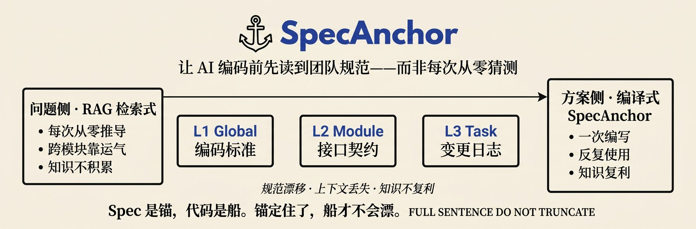

<div align="center">
  
</div>

<h1 align="center">SpecAnchor</h1>

<p align="center">
  <em>Spec 是锚，代码是船。锚定住了，船才不会漂。</em>
</p>

<p align="center">
  
</p>

<p align="center">
  
  
  
  
  
  
</p>

<p align="center">
  <a href="README_EN.md">🇬🇧 English</a> ·
  <a href="README.md">🇨🇳 中文</a> ·
  <a href="WHY.md">📖 为什么需要</a> ·
  <a href="SKILL.md">🧭 协议入口</a>
</p>

---

## 📌 SpecAnchor 是什么？

**AI 每次开启新对话就像一个初来乍到的新人，能力牛逼闪闪，扎进项目代码却一头雾水。SpecAnchor 让它在茫茫码海里读到前人走过的路。**

SpecAnchor 把团队的编码标准、模块契约、变更历史**预先编译**成持久化 Spec 文件，AI 写代码前自动加载——而不是每次从源码重新推导。一次编写，反复使用：知识持续复利，而不是会话结束就蒸发。

它是 Spec 的**图书馆，不是写作工具**——兼容 SDD-RIPER-ONE、OpenSpec 或自定义 schema，可插拔。锚定的不只是 AI 上下文，更是人对代码的认知。

---

## 🌊 Before & After

| ❌ 无 SpecAnchor | ✅ 有 SpecAnchor |
| :--- | :--- |
| AI 每次从代码重新推导规范 | AI 先加载已编译的 Spec |
| 跨模块靠运气 | 模块契约被锚定 |
| 知识不积累 | 知识持续复利 |

> **编译式知识 vs 检索式知识** — 详见 [WHY.md §编译式知识 vs 检索式知识](WHY.md#编译式知识-vs-检索式知识)

---

## ✨ 与众不同之处

市面上的 Spec 工具大多教你**怎么写 Spec**。SpecAnchor 做别人不做的事：

- **📚 编译式知识，而非检索式**
  Spec 预先编译并加载，AI 不再从源码重新推导规范。

- **🧭 内建三级治理**
  L1 全局（标准）· L2 模块（契约）· L3 任务（变更日志），各有独立节奏。

- **🩺 Spec 健康是一等公民**
  覆盖率 · 腐化检测 · 角色权限 · 模块索引——OpenSpec / SDD-RIPER-ONE / spec-kit 都不提供。

- **🔌 协议无关**
  Spec 可用 SDD-RIPER-ONE、OpenSpec 或自定义 schema 编写。SpecAnchor 只管"组织"，不管"写作"。

- **🪢 寄生模式（Parasitic mode）**
  已经在用 OpenSpec 或 spec-kit？把 SpecAnchor 指向现有目录即可，无需迁移。

---

## 🧱 三级 Spec 体系

| 层级 | 名称 | 内容 | 频率 | 路径 |
| :---: | :--- | :--- | :---: | :--- |
| L1 | Global Spec | 编码标准、架构约定、项目配置 | 季度级 | `.specanchor/global/` |
| L2 | Module Spec | 接口契约、业务规则、代码结构 | 迭代级 | `.specanchor/modules/` |
| L3 | Task Spec | 单次变更的目标、计划、执行日志 | 每任务 | `.specanchor/tasks/` |

---

## 🚀 快速安装

### Claude Code

```bash
# 项目级安装
rsync -a --exclude-from=/path/to/SpecAnchor/.skillexclude \
  /path/to/SpecAnchor/ your-project/.agents/skills/specanchor/
```

然后在 `CLAUDE.md` 或 `AGENTS.md` 中添加：

```text
使用 SpecAnchor 管理 Spec：参考 .agents/skills/specanchor/SKILL.md
```

### Cursor

```bash
# 项目级安装
rsync -a --exclude-from=/path/to/SpecAnchor/.skillexclude \
  /path/to/SpecAnchor/ your-project/.cursor/skills/specanchor/

# 或软链（开发时推荐）
ln -s /path/to/SpecAnchor your-project/.cursor/skills/specanchor

# 或全局安装
rsync -a --exclude-from=/path/to/SpecAnchor/.skillexclude \
  /path/to/SpecAnchor/ ~/.cursor/skills/specanchor/
```

### 其他 AI 工具

SpecAnchor 是纯文本 Skill，任何支持读取文件的 AI 工具都可用：

```bash
rsync -a --exclude-from=/path/to/SpecAnchor/.skillexclude \
  /path/to/SpecAnchor/ your-project/<skill-dir>/
```

在 AI 工具配置中引用 `SKILL.md` 即可。

> 💡 **为什么不用 `cp -r`？** 仓库含有不应进入目标项目的 `.specanchor/`、`mydocs/`、`tests/` 等开发目录。`.skillexclude` 声明了需要排除的路径。

---

## 💬 典型流程

```text
> "帮我初始化 SpecAnchor"
  → 生成 anchor.yaml + 可选 .specanchor/ + 自动检测已有 Spec 体系

> "帮我创建 auth 模块的规范"
  → 触碰模块时按需创建 Module Spec

> "创建任务：登录页增加验证码"
  → 自动加载 Global + Module Spec，创建 Task Spec

> "检查 Spec 和代码对齐"
  → 运行覆盖率 + 腐化检测
```

---

## 🗺️ 命令速查

| 意图 | 说法示例 |
| :--- | :--- |
| 初始化 | `"初始化 SpecAnchor"` · `"初始化项目信息"` |
| 全局规范 | `"生成编码规范"` · `"生成架构约定"` |
| 模块规范 | `"创建 auth 模块规范"` · `"从代码推断模块规范"` |
| 任务 | `"创建任务：XX 功能"` |
| 检测 | `"检查 Spec 对齐"` · `"覆盖率报告"` · `"模块规范是否过期"` |
| 外部导入 | `"导入 OpenSpec 配置"` · `"兼容 OpenSpec"` |

---

## 🔗 写作协议矩阵

SpecAnchor 只管"组织"，不管"写作"——通过声明式 Schema 系统兼容任何 Spec 格式：

| 协议 | 哲学 | 流程 | 切换方式 |
| :--- | :---: | :--- | :--- |
| **SDD-RIPER-ONE** *(默认)* | strict | Research → Plan（门禁）→ Execute → Review | 默认，无需配置 |
| **OpenSpec** | fluid | Proposal → Delta Specs → Design → Tasks | `writing_protocol.schema: "openspec-compat"` |
| **自定义** | 用户定义 | 在 `.specanchor/schemas/` 下定义 | `writing_protocol.schema: "<name>"` |

---

<details>
<summary><b>📂 目录结构</b></summary>

### Skill 本体

```text
SpecAnchor/
├── SKILL.md                     ← Skill 入口
├── references/
│   ├── specanchor-protocol.md   ← 核心协议
│   ├── commands/                ← 命令定义（按需读取）
│   ├── schemas/                 ← 写作协议 Schema 定义
│   └── *.md                     ← 模板和参考文件
└── scripts/
    ├── specanchor-init.sh       ← 初始化（目录 + 配置）
    ├── specanchor-boot.sh       ← 启动检查
    ├── specanchor-status.sh     ← 状态报告
    ├── specanchor-index.sh      ← 索引生成
    ├── specanchor-check.sh      ← 对齐检测
    ├── frontmatter-inject.sh    ← Frontmatter 注入
    └── frontmatter-inject-and-check.sh
```

### 安装后项目（full 模式）

```text
your-project/
├── anchor.yaml                  ← 配置（项目根目录，唯一入口）
├── .specanchor/                 ← 纯数据目录
│   ├── global/                  ← L1: Global Spec（≤200 行）
│   ├── modules/                 ← L2: Module Spec（集中存放）
│   ├── module-index.md          ← 模块索引
│   ├── tasks/                   ← L3: Task Spec（按模块分目录）
│   ├── archive/                 ← 已完成任务归档
│   ├── schemas/                 ← 用户自定义 Schema
│   └── scripts/                 ← 自动生成的扫描脚本
└── src/
```

### 安装后项目（parasitic 模式）

```text
your-project/
├── anchor.yaml                  ← 仅配置
├── .specanchor/
│   └── scripts/                 ← 仅扫描脚本
├── specs/                       ← 已有 spec 体系（不动）
└── src/
```

</details>

<details>
<summary><b>⚙️ 关键配置</b></summary>

项目根目录的 `anchor.yaml` 控制 SpecAnchor 的行为，完整配置见 `references/specanchor-protocol.md` 附录 A。

```yaml
specanchor:
  version: "0.4.0"
  mode: "full"                      # full | parasitic
  sources:                          # 外部 spec 体系（可选）
    - path: "specs/"
      type: "spec-kit"
      governance:
        stale_check: true
  writing_protocol:
    schema: "sdd-riper-one"         # sdd-riper-one | openspec-compat | 自定义
  coverage:
    scan_paths: ["src/modules/**"]  # 覆盖率扫描范围
  check:
    stale_days: 14                  # Spec 过期天数阈值
    outdated_days: 30               # 严重过期天数阈值
```

</details>

<details>
<summary><b>🔌 兼容 OpenSpec 等已有 Spec 体系</b></summary>

已有 OpenSpec 项目可通过 `sources` 配置将 `openspec/` 目录纳入治理，**无需移动文件**：

```yaml
# anchor.yaml
specanchor:
  sources:
    - path: "openspec/specs"
      type: "openspec"
      maps_to: module_specs
      governance:
        stale_check: true
        frontmatter_inject: false
    - path: "openspec/changes"
      type: "openspec"
      maps_to: task_specs
      exclude: ["archive"]
      governance:
        stale_check: true
```

使用 `"导入 OpenSpec 配置"` 命令可自动生成。

### 自动检测的 Spec 体系

| 体系 | 检测路径 | 说明 |
| :--- | :--- | :--- |
| OpenSpec | `openspec/` | Spec-Driven Development 框架 |
| spec-kit | `specs/` | 通用 spec 目录 |
| mydocs | `mydocs/specs/` | SDD-RIPER-ONE 独立使用时的产出 |
| qoder | `.qoder/specs/` | Qoder AI 框架 |
| 自定义 | 用户指定 | 任何 Markdown spec 目录 |

### 两种运行模式

- **full** — 有 `.specanchor/` 自有 Spec 体系 + 可选治理外部来源
- **parasitic** — 无自有体系，纯治理已有 spec（腐化检测 + 扫描）

### SpecAnchor 独有治理能力

OpenSpec 和 SDD-RIPER-ONE 都不提供：

- **覆盖率检测** — 哪些模块有 Spec、哪些没有
- **腐化检测** — 哪些 Spec 已过期（代码改了但 Spec 没同步）
- **角色权限矩阵** — 工程师 vs 外部协作者的 Spec 操作权限
- **模块索引** — `module-index.md` 集中索引所有 Module Spec

</details>

<details>
<summary><b>👥 团队使用建议</b></summary>

| 操作 | 频率 | 负责人 |
| :--- | :---: | :--- |
| Global Spec 更新 | 季度级 | 工程师（Peer Review） |
| Module Spec 创建 | 触碰模块时 | 工程师 / 协作者（需 Review） |
| Task Spec 创建 | 每个任务 | 工程师 & 协作者 |
| 覆盖率检查 | 每 Sprint 结束 | 工程师 |
| Spec-代码对齐检测 | MR 提交时 | 自动 / 手动 |

### 渐进式覆盖

不追求 100% 覆盖，让最重要的模块先有 Spec。详见 [存量项目冷启动方案](WHY.md#存量项目冷启动方案)。

</details>

---

## 🤝 参与贡献

欢迎提交 Issue、Discussion 与 PR。提交前请先阅读 [WHY.md](WHY.md) 与 [SKILL.md](SKILL.md) 了解设计理念与核心协议。

---

## 📄 License

MIT
